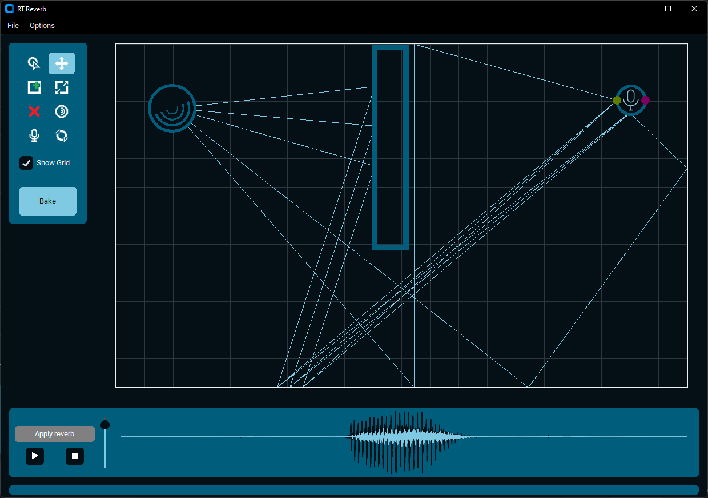

# RT Reverb
Desktop app for applying reverb to audio files in user created rooms, using ray tracing for simulating sound waves propagation. 

## Description
This app allows you to simulate how sound will behave in a room. Create virtual room, set up sound source and listening point, then run the simulation. Now select an audio file and apply the reverb. You can adjust the simulation accuracy and parameters in the settings. Room creation as well as simulation algorithm are simplified to 2D space.

## Presentation
Checkout [interactive presentation](https://karolplonka.github.io/rt_reverb/) explaining the process of Audio Ray Tracing.

## Technologies
- Python - GUI
- C - Ray Tracing Algorithm

## Supported platforms
- Windows

## Requirements
- Python, with tkinter
- GCC
- CMake
- Ninja (build system)

## Dev installation (using Windows PowerShell)
1. Clone repo:  
`git clone https://github.com/karolplonka/rt_reverb/`
2. Build:  
`.\Build.Ps1`
> [!NOTE]  
> This will build DLL library for ray tracing algorithm, create python virtual environment and install required python modules.
3. Run:  
`.\Run.Ps1`
